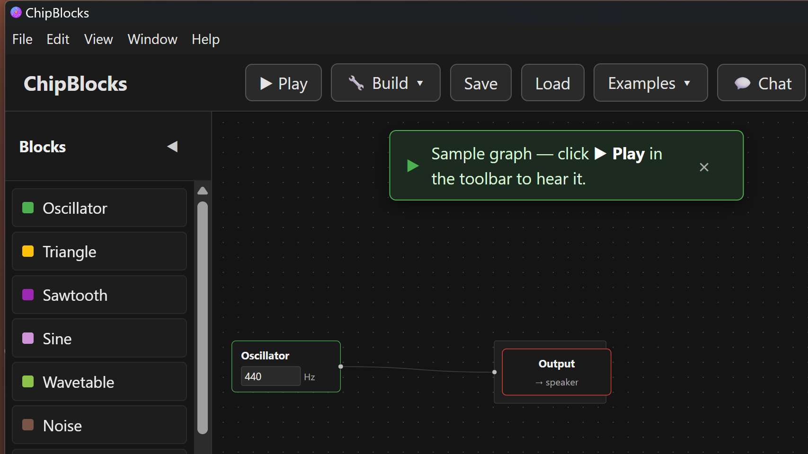

# ChipBlocks

> Visual chip design for everyone. Drag blocks, wire them together, hear the chip — then build a real FPGA bitstream or a Tiny Tapeout ASIC submission package.

**Status:** v0.1.0-alpha. Visual editor, AI consultant, simulated audio, four real-silicon output paths (Lattice iCEstick FPGA / TinyFPGA BX FPGA / 1BitSquared iCEBreaker FPGA / Tiny Tapeout ASIC submission), all working end-to-end. Public alpha.

[](LICENSE)



---

## What it is

ChipBlocks is a free, open-source desktop app that lets **non-technical people design custom silicon chips** by wiring visual blocks together. Drop an oscillator on the canvas, connect it to a mixer, connect that to an output, press ▶ Play — hear the chip you just designed simulate through your speakers. Click 🔧 Build → pick a target — get back a real flashable FPGA bitstream OR a complete Tiny Tapeout submission package that goes to a fab and comes back as a chip in your hand.

The first flagship domain is **audio / synth / retro-game chips** — including video, with the VGA Timing / Color Bars / VGA Output block trio that lets a graph drive a real monitor on the iCEBreaker FPGA's PMOD1B header. The architecture extends to custom microcontrollers, sensor pre-processors, PCBs, motherboards, and other digital chip categories in later phases.

## What it does today

```
 ┌──────────────────┐    ┌──────────────────┐    ┌────────────────────────┐
 │ Visual editor    │ →  │ Block library    │ →  │ ▶ Play                 │
 │ (React Flow)     │    │ (Amaranth HDL)   │    │ 🔧 Build → iCEstick    │
 └──────────────────┘    └──────────────────┘    │ 🔧 Build → TinyFPGA BX │
                                                 │ 🔧 Build → iCEBreaker  │
                                                 │ 🚀 Build → Tiny Tapeout│
                                                 └────────────────────────┘
                                                          ↓
                                  ┌─────────────────────────────────────────┐
                                  │ .wav (simulated audio)                  │
                                  │ + .bin + Verilog + .pcf (FPGA)          │
                                  │ + tt_top.v + info.yaml + testbench (TT) │
                                  └─────────────────────────────────────────┘
```

- **32 blocks**: oscillator (square), triangle, sawtooth, sine, noise, constant, mixer, output, ADSR envelope, gate, low-pass filter, high-pass filter, band-pass filter, sample-and-hold, FM voice, multiply (ring modulator), wavetable, bitcrusher, delay, distortion (hard-clipping waveshaper), the digital-logic primitives AND / OR / XOR / NOT / counter, the visual blocks VGA Timing / Color Bars / Pixel Range / Solid Color / VGA Output that drive a monitor through an iCEBreaker FPGA + VGA-PMOD attachment, and bus-composition blocks Bus Split / Bus Join (8-bit ↔ 8 × 1-bit fan-out / concat) for cross-width signal routing. Drag from the side palette onto the canvas.
- **Visual wiring**: edges enforce port directionality. Nodes have parameter editors with full screen-reader labels (frequency, cutoff, attack/decay/sustain/release, etc.).
- **▶ Play**: Python backend simulates the design in [Amaranth](https://github.com/amaranth-lang/amaranth), produces a 16-bit WAV at 44.1 kHz, and the app plays it.
- **🔧 Build → Lattice iCEstick**: graph → Verilog → Yosys → nextpnr-ice40 → icepack → flashable `.bin` for the Lattice iCEstick (~$30 USB dev board). Bundle includes a `BUILD.md` utilization report so you know if your design fits.
- **🔧 Build → TinyFPGA BX**: same flow targeting the iCE40LP8K-CM81 board (USB-native, ~5× the LUTs of the iCEstick).
- **🔧 Build → 1BitSquared iCEBreaker**: same iceprog flow against the iCE40UP5K-SG48 board (~$70, standard PMOD headers — the canonical board for FPGA tutorials).
- **🚀 Build → Tiny Tapeout**: 14-file submission package in canonical [`ttsky-verilog-template`](https://github.com/TinyTapeout/ttsky-verilog-template) layout (src/, test/, docs/, info.yaml validated against `tt-support-tools/project_info.py`, plus a working cocotb testbench). Drop-in ready: unzip on the GitHub template, push, submit at [app.tinytapeout.com](https://app.tinytapeout.com/). Their flow runs OpenLane on Sky130 or GF180 and ships you a real ASIC chip months later.
- **AI consultant** (BYOK): bring an Anthropic API key and chat with Claude about the design. The consultant is grounded in the full app surface (toolbar, blocks, naming conventions, what each target produces) and can read the canvas, suggest blocks, or add and wire blocks for you (with preview-and-confirm for destructive edits).
- **Save / load + 11 bundled examples**: graphs are versioned JSON. The Examples menu opens "Two oscillators mixed", "ADSR-shaped pulse", "Kick drum", "Snare drum", "Bass lead", "Lo-fi pad", "Stair-stepped arpeggio", "Echo", "Lo-fi crunch", "Color bars on a VGA monitor", and "White vertical stripe on a VGA monitor" without leaving the app.
- **Help → About** (ℹ button): version + credits + GitHub link + BYOK explainer.

## Quick start (end user)

> *The unsigned alpha will trigger a Windows SmartScreen warning the first time you run it: click "More info → Run anyway."*

1. Download the latest installer from [Releases](https://github.com/unexpear/chipblocks/releases).
2. Double-click `ChipBlocks_0.1.0.exe` and click through the installer.
3. Launch ChipBlocks from the Start Menu.
4. **For ▶ Play (audio simulation)**: install [WSL2 Ubuntu](https://learn.microsoft.com/en-us/windows/wsl/install) + Python 3.12 + the backend deps. Run `bash backend/setup.sh` from a WSL2 terminal one time. (Backend setup details: [backend/README.md](backend/README.md).)
5. **For 🔧 Build for FPGA (real silicon bitstream)**: also install the [YosysHQ OSS CAD Suite](https://github.com/YosysHQ/oss-cad-suite-build/releases) at `~/oss-cad-suite/` in WSL2.

The installer ships the GUI and the backend Python scripts. WSL2 + the OSS CAD Suite are external because they're large (the toolchain is ~2.4 GB) and many users only want the simulator.

## Quick start (developer)

Requirements: **Node 20+** on Windows, **WSL2 Ubuntu** with **Python 3.12+** for the backend.

```bash
# One-time backend setup (in WSL2):
cd backend && bash setup.sh

# Frontend (Windows side):
cd frontend
npm install
npm run dev      # Hot-reload Electron dev mode
npm run build    # Build the Windows installer (release/0.1.0/ChipBlocks_0.1.0.exe)
```

Click **▶ Play** in the running app to hear the default Oscillator → Mixer → Output graph render to audio. Click **🔧 Build for FPGA** to get an iCE40 bitstream zip.

## Roadmap

- ✅ **Sprint 1** — Foundations: Electron + React + TypeScript, React Flow node-graph editor, Migen-driven simulation producing a playable WAV.
- ✅ **Sprint 2** — Integration: Electron ↔ WSL2 ↔ Python IPC, real graph → Amaranth translator, end-to-end Play button. ([retro](SPRINT-2.md))
- ✅ **Sprint 3** — Block library expansion (triangle, saw, ADSR, filter), block-parameter editing, project save/load, AI consultant chat sidebar (BYOK Anthropic). ([retro](SPRINT-3.md))
- ✅ **Sprint 4** — Block palette + drag-to-canvas, low-pass filter, sample-and-hold, AI tool-calling so the consultant can edit the canvas, model picker. ([retro](SPRINT-4.md))
- ✅ **Sprint 5** — Multi-step agentic AI loop, smarter node placement, preview-and-apply for destructive AI tool calls. ([retro](SPRINT-5.md))
- ✅ **Sprint 6** — FPGA bitstream output: graph → Verilog → Yosys → nextpnr-ice40 → icepack → `.bin` for Lattice iCEstick. ([retro](SPRINT-6.md))
- ✅ **Sprint 7** — First public alpha: dependency upgrades, packaged Windows installer, this README. ([retro](SPRINT-7.md))
- ✅ **Sprint 8** — AI consultant grounding: full system-prompt + tool-description rewrite so the consultant knows app navigation, naming conventions, and common workflows. ([retro](SPRINT-8.md))
- ✅ **Sprint 9** — Onboarding + 6 more blocks (Sine, Noise, Constant, FM, Multiply, Wavetable), starter graph + dismissible hint, Examples menu, About modal, GitHub Actions CI + cross-platform release pipeline (Windows/Mac/Linux), 19 backend pytest + 6 frontend vitest. ([retro](SPRINT-9.md))
- ✅ **Sprint 10** — Output completeness: TinyFPGA BX added as a second FPGA target, Tiny Tapeout submission package landed (genuinely drop-in ready for the active 2026 cohorts), structured BUILD.md utilization parsing. ([retro](SPRINT-10.md))
- ✅ **Sprint 11** — Pre-public hardening: WCAG 2.1 AA Critical-tier accessibility (input labels, modal dialog semantics, focus-visible, aria-live), tech-debt batch (IPC types, pinned backend deps, README refresh), renderer security (Load JSON validation, AI tool-call validation, ErrorBoundary). ([retro](SPRINT-11.md))
- ✅ **Sprint 12** — A11y Tier 2 (palette keyboard, touch targets, popover arrows, parameter errors), test coverage explosion (6 → 50 vitest), bundle-filename coordination, argv-only build IPC, Tier 3 polish, ARCHITECTURE.md. ([retro](SPRINT-12.md))
- ✅ **Sprint 13** — Block library expansion (Bitcrusher + Delay) + CONTRIBUTING.md contributor on-ramp. ([retro](SPRINT-13.md))
- 📋 **Future** — Mac/Linux installer signing (CI pipeline already builds; needs paid certs to ship), MIDI input + polyphony, more DSP blocks (Highpass + Bandpass also already shipped), additional FPGA targets, PCBs, motherboards. See [ROADMAP.md](ROADMAP.md).

See [PRD.md](PRD.md) for the full vision.

## Project documents

| Document | What's in it |
|---|---|
| [PRD.md](PRD.md) | Full product vision, goals, non-goals, target users, requirements, success metrics |
| [ROADMAP.md](ROADMAP.md) | Operational Now / Next / Later — what's actually being built next |
| [SPRINT-1.md](SPRINT-1.md) … [SPRINT-13.md](SPRINT-13.md) | Per-sprint plan + log + retrospective |
| [ARCHITECTURE.md](ARCHITECTURE.md) | High-level code shape: process model, IPC, block-addition cookbook |
| [BLOCKS.md](BLOCKS.md) | Block library reference — every block's ports, parameters, behavior, and common-usage notes |
| [CONTRIBUTING.md](CONTRIBUTING.md) | Contributor on-ramp: setup, tests, commit style, license posture |
| [ACCESSIBILITY-AUDIT-2026-05-08.md](ACCESSIBILITY-AUDIT-2026-05-08.md) | WCAG 2.1 AA audit snapshot + tiered remediation plan |
| [CLAUDE.md](CLAUDE.md) | Project brief for AI dev tools — vision, tech stack, conventions |
| [CREDITS.md](CREDITS.md) | Open-source attributions and licensing policy |
| [KNOWN-ISSUES.md](KNOWN-ISSUES.md) | Tracked deferred issues |
| [LICENSE](LICENSE) | MIT |
| [CLA.md](CLA.md) | Contributor License Agreement |

## License

MIT. See [LICENSE](LICENSE) for details. ChipBlocks ships only permissively-licensed code (MIT / Apache 2.0 / BSD / ISC / PSF). Copyleft tools (GPL, AGPL, LGPL, MPL, EUPL) are never bundled — see [CREDITS.md](CREDITS.md) for the full policy and the explicit list of GPL/EUPL tools we considered and dropped.

## Contributing

Outside contributions are welcome. Please:

1. Read [CLA.md](CLA.md) before submitting a pull request.
2. Sign your commits with `git commit -s` (signifies your CLA agreement).
3. Open an issue first for anything beyond a typo fix or small bug.

This is a solo-developer project at a "fine taking time" pace. Issue triage and PR review may take a few days.

---

**Built with [Claude Code](https://claude.com/claude-code) by a non-technical solo developer.** The whole point of the project is to make custom chip design accessible to people like that — eat your own dog food.
